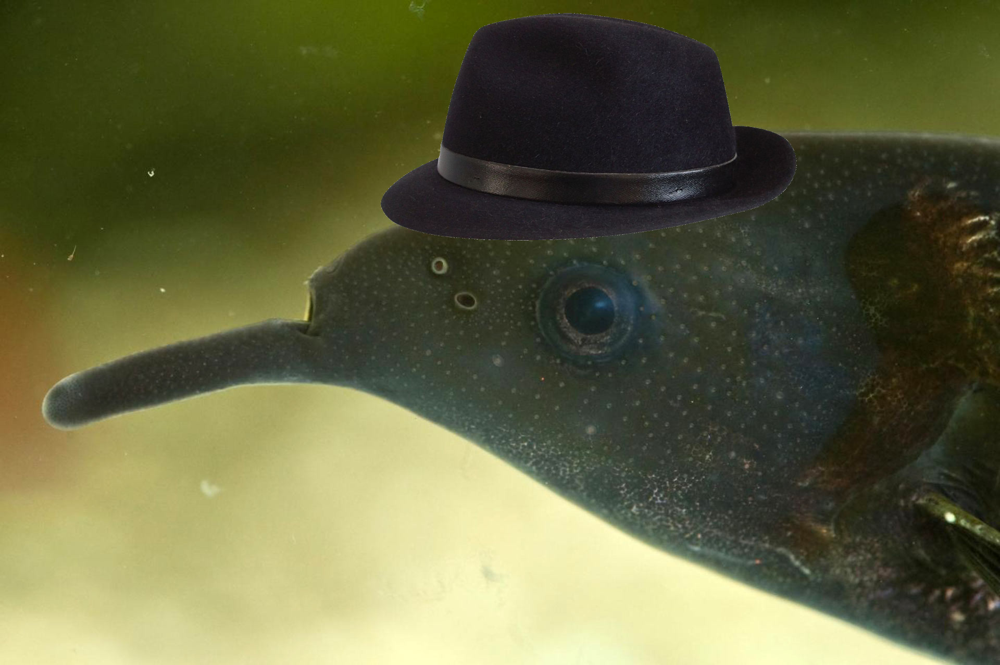

# Elephant-Fish



## Project state

Initial presentations:

- [Midterm Presentation](https://docs.google.com/presentation/d/1j3MFCuJ0u3WaQ5IgOig-MALxQPnDhmf9EoApNko3mCg/edit?usp=sharing)
- [Final Presentation](https://docs.google.com/presentation/d/1CoAPEFmZlw0pXVqQY0UqzyyiwGDfyVOOpM-6B-adfpI/edit?usp=sharing).

- Video labelling and track extraction with sleap (`data/sleap`)
- Missing data interpolation and outlier correction for tracks (`src/reader.py`)
- Evaluation and analysis of tracks (`src/evaluation.py`)
- Visualization of tracks on video or arbitrary background (`src/visualization.py`)
- Simple fish simulation (`src/train.py`)

# Setup

```bash
conda create -n ef python=3.9
conda activate ef

# install torch
# https://pytorch.org/get-started/locally/

pip install -r requirements.txt
```

# Given Videos

## Video Mapping

We mapped following names to the given videos:

```
diff_1 - DiffGroup1-1
diff_2 - DiffGroup5_2-cut
diff_3 - DiffGroup9_1-1
diff_4 - DiffGroup9_3-1
diff_5 - DiffGroup31_3-Cut
same_1 - SameGroup5_1-1
same_2 - SameGroup5_3-1
same_3 - SameGroup9_2-1
same_4 - SameGroup31_1-1
same_5 - SameGroup31_2-1
```

## Frames used

```
diff_1: entire video
diff_2: entire video
diff_3: frame 0 - 17000
diff_4: frame 120 - end
diff_5: not used
same_1: entire video
same_2: not used
same_3: frame 130 - end
same_4: entire video
same_5: entire video
```
